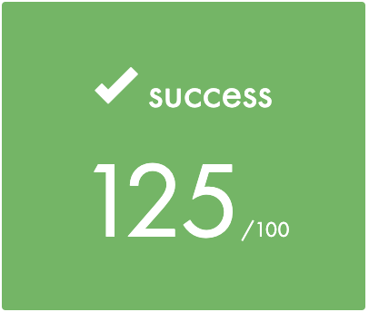

# ft_containers

School 42 Project. My implementation of C++ 98 STL containers 
<br></br>

# Final grade: 125/100

 <br></br>

## Containers

- Vector
- Map, using Red-Black Tree
- Stack, based on my implementation of Vector
- Set (Bonus part), using Red-Black Tree


## How to use

- Custom tests are presented in `./src/tests`. Use MakeFile to compile tests for my containers (`ft_tests.cpp`) and STL containers (`stl_tests.cpp`):

  ```sh
   $ make
   $ ./ft_containers
   $ ./stl_containers
   ```

- You can compare tests results of my containers vs STL containers. This command will compare results of the test sets in `.src/tests` and output the difference to the console:

	```sh
	$ make
	$ make compare
	```

- Clean generated files:

	```sh
	$ make fclean
	```

## Other test sets

- I highly recommend to use these unit tests - https://github.com/divinepet/ft_containers-unit-test